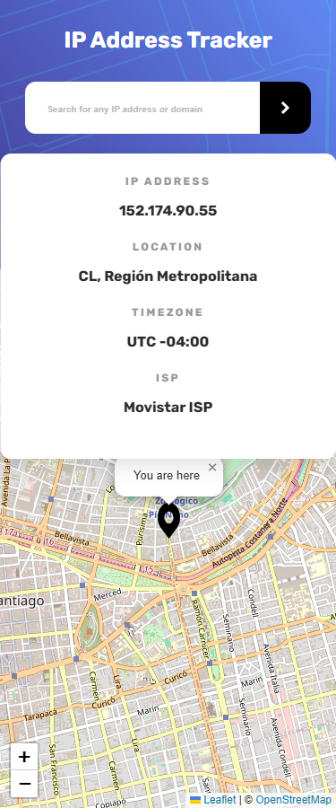
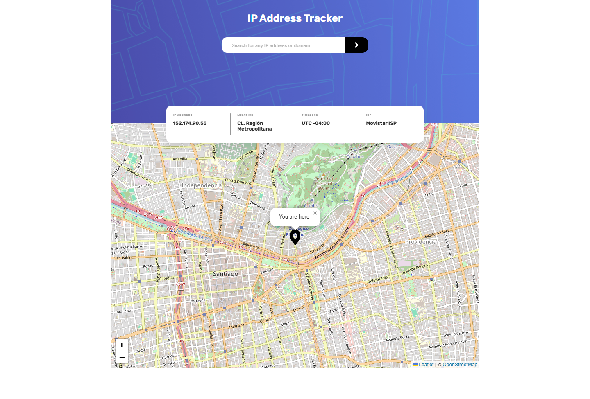

# Frontend Mentor - IP address tracker solution

This is a solution to the [IP address tracker challenge on Frontend Mentor](https://www.frontendmentor.io/challenges/ip-address-tracker-I8-0yYAH0). Frontend Mentor challenges help you improve your coding skills by building realistic projects. 

## Table of contents

- [Overview](#overview)
  - [The challenge](#the-challenge)
  - [Screenshot](#screenshot)
  - [Links](#links)
- [My process](#my-process)
  - [Built with](#built-with)
  - [What I learned](#what-i-learned)
- [Author](#author)

**Note: Delete this note and update the table of contents based on what sections you keep.**

## Overview
Reto tomando en la web de FrontenMentor, el cual consiste en desarrollar una web que busque la ip introducida y que a través de servicios de Apis me genere la ubicación aproxima, este tiene que rellenar campos de información y generar un mapa con un marcador de posición.

### The challenge

Users should be able to:

- View the optimal layout for each page depending on their device's screen size
- See hover states for all interactive elements on the page
- See their own IP address on the map on the initial page load
- Search for any IP addresses or domains and see the key information and location

### Screenshot

### Links

- Solution URL: [Add solution URL here](https://github.com/cyeguez/IP-Address-Tracker)
- Live Site URL: [Add live site URL here](https://cyeguez.github.io/IP-Address-Tracker/)

## My process
- Investigar el tema en cuestión.
- Indagar sobre las APIS
- General un bosquejo general de la lógica.
- Analizar el diseño del maquetado.
- Proceder al desarrollo de los elementos html y css
- Construir lógica en js.

### Built with

- Semantic HTML5 markup
- CSS custom properties
- Flexbox
- CSS Grid
- Mobile-first workflow

**Note: These are just examples. Delete this note and replace the list above with your own choices**

### What I learned

- El uso de Apis de geolocalización.
- Leer La documentación de sus usos.
- uso del clamp en css

## Author

- Frontend Mentor - [@yourusername](https://www.frontendmentor.io/profile/cyeguez)
- Twitter - [@yourusername](https://www.twitter.com/yourusername)
**Note: Delete this note and add/remove/edit lines above based on what links you'd like to share.**

